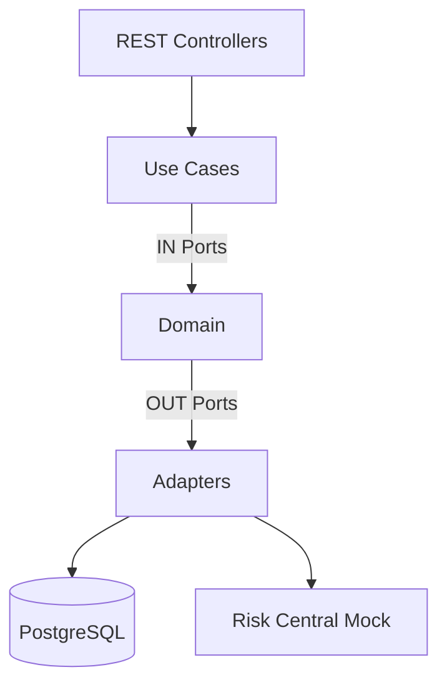

# CoopCredit Microservices Platform

A modern, cloud-native credit application platform built with **Java 21** and **Spring Boot 3.5**. The system follows **Hexagonal Architecture** and uses a microservices approach with Docker orchestration.

## 🏗️ System Architecture

The platform consists of the following components:

| Service | Technology | Port | Description |
|---------|------------|------|-------------|
| **Creddit Application** | Java / Spring Boot | `8080` | Core domain logic, auth, and credit management. |
| **Risk Central Mock** | Java / Spring Boot | `8081` | Simulates external risk evaluation agency. |
| **PostgreSQL** | Database | `5433` | Primary data store. |
| **Prometheus** | Monitoring | `19090` | Metrics collection. |
| **Grafana** | Visualization | `3000` | Dashboards and alerts. |

### Hexagonal Architecture Diagram



For more details see:
- [Architecture Documentation](docs/architecture.md)
- [Hexagonal Architecture](docs/hexagonal-architecture.md)

## 🚀 Quick Start

### Prerequisites
- Docker & Docker Compose
- Java 21 (for local dev)

### Run Everything (Docker)
To start the entire ecosystem (Backend, Mock, DB, Monitoring):

```bash
./start.sh
```
Or manually:
```bash
docker-compose up -d --build
```

### Stop Services
```bash
./stop.sh
```

## 🔗 Access Points

- **Creddit Service API**: [http://localhost:8080/swagger-ui.html](http://localhost:8080/swagger-ui.html)
- **Risk Service API**: [http://localhost:8081/swagger-ui.html](http://localhost:8081/swagger-ui.html)
- **Grafana Dashboards**: [http://localhost:3000](http://localhost:3000) (User: `admin` / Pass: `admin`)
- **Prometheus**: [http://localhost:19090](http://localhost:19090)

## 📂 Project Structure

```text
CoopCredit/
├── creddit-application-service/  # Main Domain Service (Hexagonal)
├── risk-central-mock-service/    # External Dependency Mock
├── monitoring/                   # Prometheus Config
├── docs/                         # Documentation
│   ├── architecture.md
│   ├── hexagonal-architecture.md
│   ├── roles-and-flows.md
│   ├── run.md
│   └── postman/
│       └── CoopCredit.postman_collection.json
├── docker-compose.yml            # Orchestration
├── start.sh                      # Startup Script
└── stop.sh                       # Shutdown Script
```

## 🔐 Roles & Business Flows

### Supported Roles
- `ROLE_AFILIADO`: Can submit and view their own credit applications
- `ROLE_ANALISTA`: Can view and evaluate pending applications
- `ROLE_ADMIN`: Full access to all operations

### Main Flows
1. **Affiliate Registration** (Admin only): `POST /api/affiliates`
2. **Credit Application** (Afiliado): `POST /api/credit-applications`
3. **Risk Evaluation** (Analyst/Admin): `POST /api/credit-applications/{id}/evaluate`

See [Roles and Flows Documentation](docs/roles-and-flows.md) for details.

## 📬 API Testing with Postman

Import the Postman collection to test the API:
- Collection: `docs/postman/CoopCredit.postman_collection.json`
- Set environment variable `baseUrl` to `http://localhost:8080`
- The collection includes authentication flow and all main endpoints

## 🧪 Testing

Run unit and integration tests for the backend services:
```bash
cd creddit-application-service
./mvnw test
```