# Arquitectura Hexagonal - CoopCredit

## Diagrama de Arquitectura Hexagonal

```mermaid
graph TB
    subgraph "Infrastructure Layer - Adapters"
        subgraph "Input Adapters (Driving)"
            REST[REST Controllers]
            SWAGGER[Swagger UI]
        end
        
        subgraph "Output Adapters (Driven)"
            JPA[JPA Repository]
            RISK[Risk Central Client]
            JWT[JWT Provider]
        end
    end
    
    subgraph "Application Layer"
        UC1[RegisterAffiliate UseCase]
        UC2[RegisterCreditApplication UseCase]
        UC3[EvaluateCreditApplication UseCase]
        UC4[AuthenticateUser UseCase]
    end
    
    subgraph "Domain Layer - Core"
        subgraph "Domain Models"
            AFFILIATE[Affiliate]
            CREDIT[CreditApplication]
            RISKEVAL[RiskEvaluation]
            USER[User]
        end
        
        subgraph "Domain Ports"
            subgraph "Input Ports"
                IP1[RegisterAffiliateUseCase]
                IP2[RegisterCreditApplicationUseCase]
                IP3[EvaluateCreditApplicationUseCase]
                IP4[AuthenticateUserUseCase]
            end
            
            subgraph "Output Ports"
                OP1[AffiliateRepositoryPort]
                OP2[CreditApplicationRepositoryPort]
                OP3[RiskEvaluationPort]
                OP4[UserRepositoryPort]
            end
        end
        
        subgraph "Domain Services"
            VS[ValidationService]
            CS[CalculationService]
        end
    end
    
    REST --> UC1
    REST --> UC2
    REST --> UC3
    REST --> UC4
    
    UC1 --> IP1
    UC2 --> IP2
    UC3 --> IP3
    UC4 --> IP4
    
    IP1 --> AFFILIATE
    IP2 --> CREDIT
    IP3 --> RISKEVAL
    IP4 --> USER
    
    UC1 --> OP1
    UC2 --> OP2
    UC2 --> OP3
    UC3 --> OP3
    UC4 --> OP4
    
    OP1 --> JPA
    OP2 --> JPA
    OP3 --> RISK
    OP4 --> JPA
    
    VS --> AFFILIATE
    VS --> CREDIT
    CS --> CREDIT
    CS --> RISKEVAL
```

## Descripción de Capas

### 1. Domain Layer (Core)
- **Entidades**: POJOs puros sin dependencias del framework
  - `Affiliate`: Representa un afiliado de la cooperativa
  - `CreditApplication`: Solicitud de crédito
  - `RiskEvaluation`: Evaluación de riesgo
  - `User`: Usuario del sistema

- **Puertos de Entrada** (Interfaces que definen casos de uso):
  - `RegisterAffiliateUseCase`
  - `RegisterCreditApplicationUseCase`
  - `EvaluateCreditApplicationUseCase`
  - `AuthenticateUserUseCase`

- **Puertos de Salida** (Interfaces para servicios externos):
  - `AffiliateRepositoryPort`
  - `CreditApplicationRepositoryPort`
  - `RiskEvaluationPort`
  - `UserRepositoryPort`

### 2. Application Layer
- **Casos de Uso**: Implementaciones de la lógica de negocio
  - Orquestan las operaciones del dominio
  - No contienen lógica de infraestructura
  - Implementan los puertos de entrada

### 3. Infrastructure Layer
- **Adaptadores de Entrada**:
  - REST Controllers: Exponen la API HTTP
  - Swagger UI: Documentación interactiva

- **Adaptadores de Salida**:
  - JPA Repositories: Persistencia en PostgreSQL
  - Risk Central Client: Integración con servicio externo
  - JWT Provider: Manejo de tokens de seguridad

## Principios de la Arquitectura Hexagonal

1. **Inversión de Dependencias**: El dominio no depende de la infraestructura
2. **Aislamiento del Dominio**: La lógica de negocio está protegida de cambios externos
3. **Testabilidad**: Fácil testing mediante mocks de los puertos
4. **Flexibilidad**: Los adaptadores pueden cambiar sin afectar el dominio

## Flujo de Datos

1. Request HTTP → REST Controller
2. Controller → Application Use Case
3. Use Case → Domain Port (Input)
4. Domain Logic Execution
5. Domain → Repository Port (Output)
6. Repository Adapter → Database
7. Response → Controller → HTTP Response
