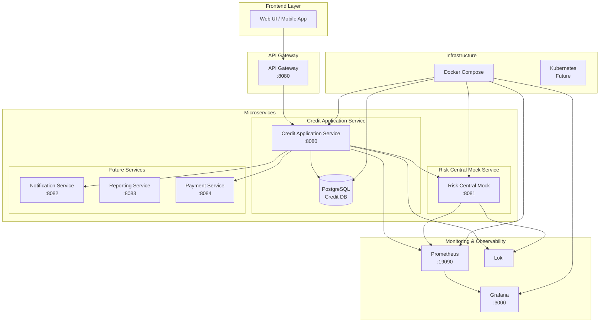
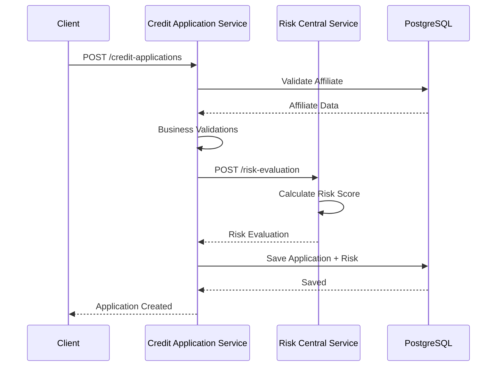

# Microservices Architecture - CoopCredit

## Microservices Diagram



## Service Description

### 1. Credit Application Service (Port 8080)

**Responsibilities**:
- Affiliate management
- Credit application processing
- Authentication and authorization (JWT)
- Risk evaluation integration

**Technologies**:
- Spring Boot 3.5
- Java 21
- PostgreSQL
- Flyway (migrations)
- JWT Security

**Main Endpoints**:
```
POST   /api/auth/register
POST   /api/auth/login
GET    /api/affiliates
POST   /api/affiliates
GET    /api/credit-applications
POST   /api/credit-applications
POST   /api/credit-applications/{id}/evaluate
```

### 2. Risk Central Mock Service (Port 8081)

**Responsibilities**:
- Credit risk evaluation simulation
- Credit score calculation
- Risk level determination
- Approval recommendations

**Technologies**:
- Spring Boot 3.5
- Java 21
- Deterministic hash-based algorithm

**Endpoints**:
```
POST   /risk-evaluation
GET    /health
GET    /swagger-ui.html
```

### 3. Future Services (Planned)

#### Notification Service (8082)
- Email sending
- SMS notifications
- Push notifications
- Webhooks

#### Reporting Service (8083)
- Report generation
- Analytics
- Executive dashboards
- Data export

#### Payment Service (8084)
- Payment processing
- Gateway integration
- Installment management
- Payment history

## Service Communication

### Communication Patterns



### Communication Types

1. **Synchronous (REST)**:
   - Credit Application → Risk Central
   - Used for critical operations
   - Timeout: 30 seconds
   - Circuit Breaker enabled

2. **Asynchronous (Future)**:
   - Notifications
   - Reports
   - Batch processing

## Docker Compose Configuration

```yaml
version: '3.8'

services:
  db:
    image: postgres:15-alpine
    environment:
      POSTGRES_DB: coopcredit_db
      POSTGRES_USER: coopcredit_user
      POSTGRES_PASSWORD: coopcredit_pass
    ports:
      - "5432:5432"
    volumes:
      - postgres_data:/var/lib/postgresql/data

  credit-application-service:
    build: ./creddit-application-service
    ports:
      - "8080:8080"
    environment:
      DB_HOST: db
      RISK_CENTRAL_URL: http://risk-central:8081
    depends_on:
      - db
      - risk-central

  risk-central:
    build: ./risk-central-mock-service
    ports:
      - "8081:8081"

  prometheus:
    image: prom/prometheus
    ports:
      - "19090:9090"
    volumes:
      - ./monitoring/prometheus.yml:/etc/prometheus/prometheus.yml

  grafana:
    image: grafana/grafana
    ports:
      - "3000:3000"
    environment:
      GF_SECURITY_ADMIN_PASSWORD: admin

volumes:
  postgres_data:
```

## Observability and Monitoring

### Collected Metrics

1. **Application Metrics**:
   - Requests per second
   - Latency per endpoint
   - Error rate
   - JVM metrics (heap, threads, GC)

2. **Business Metrics**:
   - Applications created
   - Applications approved/rejected
   - Average evaluation time
   - Average risk score

3. **Infrastructure Metrics**:
   - CPU usage
   - Memory usage
   - Disk I/O
   - Network traffic

### Health Checks

All services expose health endpoints:
```
GET /actuator/health
GET /actuator/info
GET /actuator/metrics
GET /actuator/prometheus
```

## Security

### Authentication and Authorization

- JWT tokens with 24h expiration
- Roles: ADMIN, ANALYST, AFFILIATE
- HTTPS in production
- Rate limiting

### Network Security

- Internal services not exposed
- Encrypted communication
- Secrets management
- CORS configured

## Scalability

### Scaling Strategies

1. **Horizontal Scaling**:
   - Multiple instances of each service
   - Load balancing with nginx/HAProxy
   - Stateless sessions (JWT)

2. **Vertical Scaling**:
   - JVM resource tuning
   - Connection pool optimization
   - Strategic caching

3. **Database Scaling**:
   - Read replicas
   - Connection pooling
   - Query optimization
   - Proper indexing

## Deployment

### Environments

1. **Development**:
   - Local Docker Compose
   - H2/PostgreSQL database
   - Mock services

2. **Staging**:
   - Docker Swarm/K8s
   - Dedicated PostgreSQL
   - Real services

3. **Production**:
   - Kubernetes
   - PostgreSQL cluster
   - Auto-scaling
   - Multi-region
