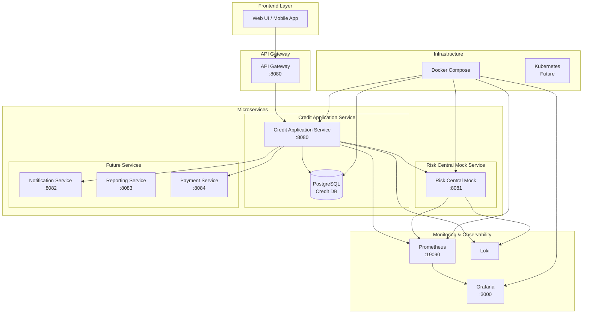
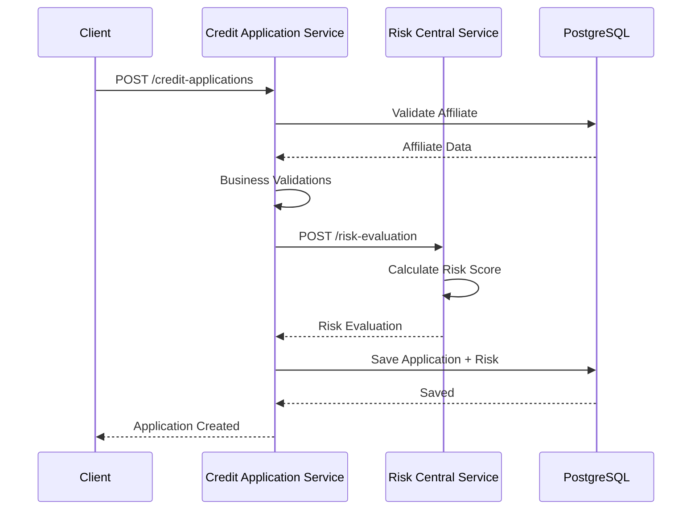

# Arquitectura de Microservicios - CoopCredit

## Diagrama de Microservicios



## Descripción de Servicios

### 1. Credit Application Service (Puerto 8080)
**Responsabilidades**:
- Gestión de afiliados
- Procesamiento de solicitudes de crédito
- Autenticación y autorización (JWT)
- Integración con evaluación de riesgo

**Tecnologías**:
- Spring Boot 3.5
- Java 21
- PostgreSQL
- Flyway (migraciones)
- JWT Security

**Endpoints principales**:
```
POST   /api/auth/register
POST   /api/auth/login
GET    /api/affiliates
POST   /api/affiliates
GET    /api/credit-applications
POST   /api/credit-applications
POST   /api/credit-applications/{id}/evaluate
```

### 2. Risk Central Mock Service (Puerto 8081)
**Responsabilidades**:
- Simulación de evaluación de riesgo crediticio
- Cálculo de score crediticio
- Determinación de nivel de riesgo
- Recomendaciones de aprobación

**Tecnologías**:
- Spring Boot 3.5
- Java 21
- Algoritmo determinístico basado en hash

**Endpoints**:
```
POST   /risk-evaluation
GET    /health
GET    /swagger-ui.html
```

### 3. Servicios Futuros (Planificados)

#### Notification Service (8082)
- Envío de emails
- SMS notifications
- Push notifications
- Webhooks

#### Reporting Service (8083)
- Generación de reportes
- Analytics
- Dashboards ejecutivos
- Exportación de datos

#### Payment Service (8084)
- Procesamiento de pagos
- Integración con pasarelas
- Gestión de cuotas
- Historial de pagos

## Comunicación entre Servicios

### Patrones de Comunicación



### Tipos de Comunicación

1. **Síncrona (REST)**:
   - Credit Application → Risk Central
   - Usado para operaciones críticas
   - Timeout: 30 segundos
   - Circuit Breaker habilitado

2. **Asíncrona (Futura)**:
   - Notificaciones
   - Reportes
   - Procesamiento batch

## Configuración de Docker Compose

```yaml
version: '3.8'

services:
  db:
    image: postgres:15-alpine
    environment:
      POSTGRES_DB: coopcredit_db
      POSTGRES_USER: coopcredit_user
      POSTGRES_PASSWORD: coopcredit_pass
    ports:
      - "5432:5432"
    volumes:
      - postgres_data:/var/lib/postgresql/data

  credit-application-service:
    build: ./creddit-application-service
    ports:
      - "8080:8080"
    environment:
      DB_HOST: db
      RISK_CENTRAL_URL: http://risk-central:8081
    depends_on:
      - db
      - risk-central

  risk-central:
    build: ./risk-central-mock-service
    ports:
      - "8081:8081"

  prometheus:
    image: prom/prometheus
    ports:
      - "19090:9090"
    volumes:
      - ./monitoring/prometheus.yml:/etc/prometheus/prometheus.yml

  grafana:
    image: grafana/grafana
    ports:
      - "3000:3000"
    environment:
      GF_SECURITY_ADMIN_PASSWORD: admin

volumes:
  postgres_data:
```

## Observabilidad y Monitoreo

### Métricas Recolectadas

1. **Métricas de Aplicación**:
   - Requests por segundo
   - Latencia por endpoint
   - Tasa de error
   - JVM metrics (heap, threads, GC)

2. **Métricas de Negocio**:
   - Solicitudes creadas
   - Solicitudes aprobadas/rechazadas
   - Tiempo promedio de evaluación
   - Score promedio de riesgo

3. **Métricas de Infraestructura**:
   - CPU usage
   - Memory usage
   - Disk I/O
   - Network traffic

### Health Checks

Todos los servicios exponen endpoints de salud:
```
GET /actuator/health
GET /actuator/info
GET /actuator/metrics
GET /actuator/prometheus
```

## Seguridad

### Autenticación y Autorización
- JWT tokens con 24h de expiración
- Roles: ADMIN, ANALISTA, AFILIADO
- HTTPS en producción
- Rate limiting

### Seguridad de Red
- Servicios internos no expuestos
- Comunicación encriptada
- Secrets management
- CORS configurado

## Escalabilidad

### Estrategias de Escalado

1. **Horizontal Scaling**:
   - Multiple instancias de cada servicio
   - Load balancing con nginx/HAProxy
   - Sesiones stateless (JWT)

2. **Vertical Scaling**:
   - Ajuste de recursos JVM
   - Optimización de pool de conexiones
   - Caching estratégico

3. **Database Scaling**:
   - Read replicas
   - Connection pooling
   - Query optimization
   - Índices apropiados

## Deployment

### Ambientes

1. **Development**:
   - Docker Compose local
   - Base de datos H2/PostgreSQL
   - Mock services

2. **Staging**:
   - Docker Swarm/K8s
   - PostgreSQL dedicado
   - Servicios reales

3. **Production**:
   - Kubernetes
   - PostgreSQL cluster
   - Auto-scaling
   - Multi-region
