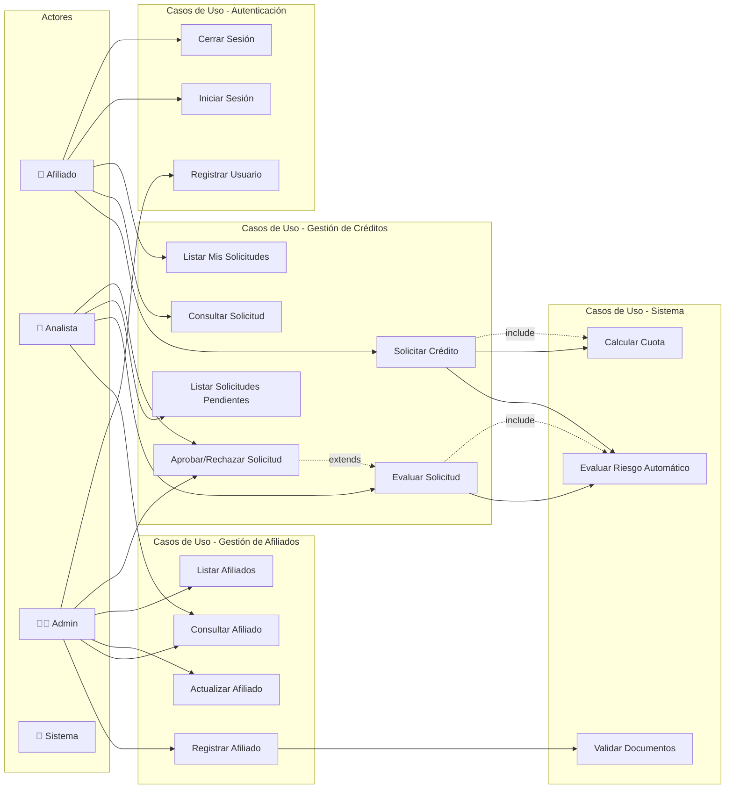

# Diagrama de Casos de Uso - CoopCredit

## Diagrama Principal

## Descripción de Casos de Uso

### Gestión de Afiliados

#### UC1: Registrar Afiliado
- **Actor Principal**: Admin
- **Precondiciones**: Usuario autenticado con rol ADMIN
- **Flujo Principal**:
  1. Admin ingresa datos del afiliado
  2. Sistema valida documento único
  3. Sistema valida datos requeridos
  4. Sistema crea afiliado con estado ACTIVO
  5. Sistema retorna confirmación

#### UC2: Consultar Afiliado
- **Actores**: Admin, Analista
- **Precondiciones**: Usuario autenticado
- **Flujo Principal**:
  1. Usuario busca por documento o ID
  2. Sistema retorna datos del afiliado

### Gestión de Créditos

#### UC5: Solicitar Crédito
- **Actor Principal**: Afiliado
- **Precondiciones**: 
  - Afiliado autenticado
  - Afiliado con estado ACTIVO
  - Antigüedad mínima 6 meses
- **Flujo Principal**:
  1. Afiliado ingresa monto, plazo y propósito
  2. Sistema valida monto máximo según salario
  3. Sistema calcula cuota mensual
  4. Sistema valida relación cuota/ingreso < 40%
  5. Sistema invoca evaluación de riesgo automática
  6. Sistema crea solicitud con estado PENDING
  7. Sistema retorna número de solicitud

#### UC8: Evaluar Solicitud
- **Actor Principal**: Analista
- **Precondiciones**: 
  - Usuario autenticado con rol ANALISTA
  - Solicitud en estado PENDING
- **Flujo Principal**:
  1. Analista revisa solicitud y evaluación de riesgo
  2. Analista puede solicitar re-evaluación
  3. Sistema actualiza evaluación de riesgo
  4. Analista toma decisión

#### UC14: Evaluar Riesgo Automático
- **Actor**: Sistema
- **Trigger**: Nueva solicitud o re-evaluación
- **Flujo**:
  1. Sistema envía datos a Risk Central
  2. Risk Central calcula score (0-1000)
  3. Risk Central determina nivel de riesgo
  4. Sistema almacena evaluación
  5. Sistema actualiza estado de solicitud

### Autenticación y Seguridad

#### UC11: Registrar Usuario
- **Actor Principal**: Admin
- **Flujo Principal**:
  1. Admin crea usuario con rol específico
  2. Sistema valida username único
  3. Sistema hashea password
  4. Sistema asocia con afiliado si aplica

#### UC12: Iniciar Sesión
- **Actores**: Todos
- **Flujo Principal**:
  1. Usuario ingresa credenciales
  2. Sistema valida credenciales
  3. Sistema genera JWT token
  4. Sistema retorna token y rol

## Matriz de Permisos por Rol

| Caso de Uso | AFILIADO | ANALISTA | ADMIN |
|-------------|----------|----------|--------|
| Registrar Afiliado | ❌ | ❌ | ✅ |
| Consultar Afiliado | ❌ | ✅ | ✅ |
| Actualizar Afiliado | ❌ | ❌ | ✅ |
| Listar Afiliados | ❌ | ❌ | ✅ |
| Solicitar Crédito | ✅ | ❌ | ❌ |
| Consultar Solicitud | ✅* | ✅ | ✅ |
| Listar Mis Solicitudes | ✅ | ❌ | ❌ |
| Evaluar Solicitud | ❌ | ✅ | ✅ |
| Listar Solicitudes Pendientes | ❌ | ✅ | ✅ |
| Aprobar/Rechazar | ❌ | ✅ | ✅ |

*Solo sus propias solicitudes

## Reglas de Negocio Principales

1. **Validación de Afiliado**:
   - Documento único en el sistema
   - Salario > 0
   - Estado debe ser ACTIVO para solicitar crédito

2. **Validación de Crédito**:
   - Monto máximo = Salario × 10
   - Cuota mensual < 40% del salario
   - Antigüedad mínima: 6 meses
   - Plazo: 6-60 meses

3. **Evaluación de Riesgo**:
   - Score 0-400: ALTO riesgo → Rechazo automático
   - Score 401-700: MEDIO riesgo → Revisión manual
   - Score 701-1000: BAJO riesgo → Pre-aprobado

4. **Seguridad**:
   - JWT con expiración 24 horas
   - Passwords hasheados con BCrypt
   - Validación de roles en cada endpoint
