# Use Case Diagram - CoopCredit

## Main Diagram

```mermaid
graph LR
    subgraph "Actors"
        AFFILIATE[👤 Affiliate]
        ANALYST[👔 Analyst]
        ADMIN[👨‍💼 Admin]
        SYSTEM[🤖 System]
    end
    
    subgraph "Use Cases - Affiliate Management"
        UC1[Register Affiliate]
        UC2[View Affiliate]
        UC3[Update Affiliate]
        UC4[List Affiliates]
    end
    
    subgraph "Use Cases - Credit Management"
        UC5[Submit Credit Application]
        UC6[View Application]
        UC7[List My Applications]
        UC8[Evaluate Application]
        UC9[List Pending Applications]
        UC10[Approve/Reject Application]
    end
    
    subgraph "Use Cases - Authentication"
        UC11[Register User]
        UC12[Login]
        UC13[Logout]
    end
    
    subgraph "Use Cases - System"
        UC14[Automatic Risk Evaluation]
        UC15[Calculate Payment]
        UC16[Validate Documents]
    end
    
    %% Admin Relations
    ADMIN --> UC1
    ADMIN --> UC2
    ADMIN --> UC3
    ADMIN --> UC4
    ADMIN --> UC10
    ADMIN --> UC11
    
    %% Analyst Relations
    ANALYST --> UC2
    ANALYST --> UC8
    ANALYST --> UC9
    ANALYST --> UC10
    
    %% Affiliate Relations
    AFFILIATE --> UC5
    AFFILIATE --> UC6
    AFFILIATE --> UC7
    AFFILIATE --> UC12
    AFFILIATE --> UC13
    
    %% System Relations
    UC5 --> UC14
    UC8 --> UC14
    UC5 --> UC15
    UC1 --> UC16
    
    %% Includes
    UC5 -.include.-> UC15
    UC8 -.include.-> UC14
    
    %% Extends
    UC10 -.extends.-> UC8
```

## Use Case Descriptions

### Affiliate Management

#### UC1: Register Affiliate

- **Primary Actor**: Admin
- **Preconditions**: User authenticated with ADMIN role
- **Main Flow**:
  1. Admin enters affiliate data
  2. System validates unique document
  3. System validates required fields
  4. System creates affiliate with ACTIVE status
  5. System returns confirmation

#### UC2: View Affiliate

- **Actors**: Admin, Analyst
- **Preconditions**: User authenticated
- **Main Flow**:
  1. User searches by document or ID
  2. System returns affiliate data

### Credit Management

#### UC5: Submit Credit Application

- **Primary Actor**: Affiliate
- **Preconditions**: 
  - Affiliate authenticated
  - Affiliate with ACTIVE status
  - Minimum 6 months seniority
- **Main Flow**:
  1. Affiliate enters amount, term, and purpose
  2. System validates maximum amount based on salary
  3. System calculates monthly payment
  4. System validates debt-to-income ratio < 40%
  5. System invokes automatic risk evaluation
  6. System creates application with PENDING status
  7. System returns application number

#### UC8: Evaluate Application

- **Primary Actor**: Analyst
- **Preconditions**: 
  - User authenticated with ANALYST role
  - Application in PENDING status
- **Main Flow**:
  1. Analyst reviews application and risk evaluation
  2. Analyst can request re-evaluation
  3. System updates risk evaluation
  4. Analyst makes decision

#### UC14: Automatic Risk Evaluation

- **Actor**: System
- **Trigger**: New application or re-evaluation
- **Flow**:
  1. System sends data to Risk Central
  2. Risk Central calculates score (0-1000)
  3. Risk Central determines risk level
  4. System stores evaluation
  5. System updates application status

### Authentication and Security

#### UC11: Register User

- **Primary Actor**: Admin
- **Main Flow**:
  1. Admin creates user with specific role
  2. System validates unique username
  3. System hashes password
  4. System associates with affiliate if applicable

#### UC12: Login

- **Actors**: All
- **Main Flow**:
  1. User enters credentials
  2. System validates credentials
  3. System generates JWT token
  4. System returns token and role

## Role Permission Matrix

| Use Case | AFFILIATE | ANALYST | ADMIN |
|----------|-----------|---------|-------|
| Register Affiliate | ❌ | ❌ | ✅ |
| View Affiliate | ❌ | ✅ | ✅ |
| Update Affiliate | ❌ | ❌ | ✅ |
| List Affiliates | ❌ | ❌ | ✅ |
| Submit Credit Application | ✅ | ❌ | ❌ |
| View Application | ✅* | ✅ | ✅ |
| List My Applications | ✅ | ❌ | ❌ |
| Evaluate Application | ❌ | ✅ | ✅ |
| List Pending Applications | ❌ | ✅ | ✅ |
| Approve/Reject | ❌ | ✅ | ✅ |

*Only their own applications

## Main Business Rules

1. **Affiliate Validation**:
   - Unique document in the system
   - Salary > 0
   - Status must be ACTIVE to apply for credit

2. **Credit Validation**:
   - Maximum amount = Salary × 10
   - Monthly payment < 40% of salary
   - Minimum seniority: 6 months
   - Term: 6-60 months

3. **Risk Evaluation**:
   - Score 0-400: HIGH risk → Automatic rejection
   - Score 401-700: MEDIUM risk → Manual review
   - Score 701-1000: LOW risk → Pre-approved

4. **Security**:
   - JWT with 24-hour expiration
   - Passwords hashed with BCrypt
   - Role validation on each endpoint
