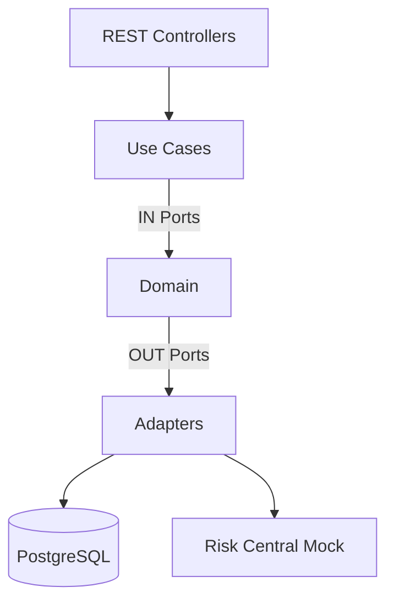

# Hexagonal Architecture (Ports & Adapters)

This service follows a strict hexagonal architecture to keep the domain isolated from frameworks.

## Layers

- Domain: Entities, Value Objects, Exceptions, Ports (IN/OUT). No framework dependencies.
- Application: Use Cases orchestrating domain rules through ports.
- Infrastructure: Web (REST controllers), Persistence (JPA), External adapters (Risk Central REST).

## Diagram

## Ports

- IN Ports: `RegisterAffiliateUseCase`, `RegisterCreditApplicationUseCase`, `EvaluateCreditApplicationUseCase`, etc.
- OUT Ports: `AffiliateRepositoryPort`, `CreditApplicationRepositoryPort`, `RiskCentralPort`, `UserRepositoryPort`.

## Benefits

- Testable domain logic.
- Swappable adapters (e.g., switch mock risk service with real one).
- Framework changes do not leak into the domain.
